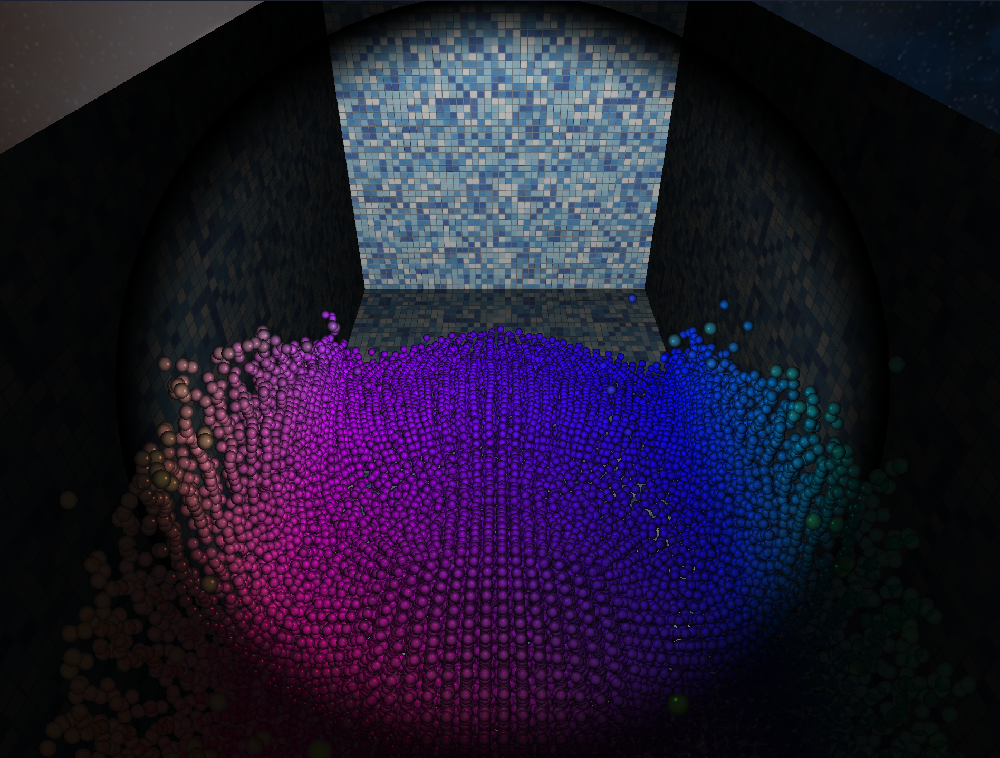

# Water Simulation

Combined SPH and OpenGL.



[Demonstration Video](https://youtu.be/V2EF1tZfBZM)


## Todo

* [X] A free 3D camera
* [X] Water particles simulation
* [X] Basic visual effect: skybox, lighting, texture
* [ ] Connect particles into a surface

## Building Requirements

### Prerequisites
- CUDA Toolkit (12.x or later)
- NVIDIA GPU Driver (575 or later)
- CMake (3.18 or later)
- GCC/G++

### Ubuntu Dependencies Installation
```bash
# Update package list
sudo apt update

# Install required development packages
sudo apt install libglfw3-dev     # GLFW
sudo apt install libglm-dev       # GLM Mathematics Library
sudo apt install libstb-dev       # STB Image Library
sudo apt install libglew-dev      # GLEW
sudo apt install freeglut3-dev    # FreeGLUT
```

### NVIDIA Configuration
```bash
# Install NVIDIA utilities
sudo apt install nvidia-prime nvidia-settings

# Configure system to use NVIDIA GPU
sudo prime-select nvidia
sudo nvidia-xconfig

# Log out and log back in (or restart) for changes to take effect
```

### Build Instructions
```bash
# Create build directory
mkdir build
cd build

# Configure with CMake
cmake ..

# Build the project
make
```

### Running the Application
```bash
# Run with NVIDIA GPU (recommended)
__NV_PRIME_RENDER_OFFLOAD=1 __GLX_VENDOR_LIBRARY_NAME=nvidia ./app

# Or run normally if NVIDIA is your primary GPU
./app
```

## User Manual


| Key/Mouse Action | User Action                                         | Functionality                                             |
| ---------------- | --------------------------------------------------- | --------------------------------------------------------- |
| Left Mouse Click | Hold                                                | Focus on the camera and enable camera rotation            |
| Mouse Movement   | Move Up/Down/Left/Right (after focusing the camera) | Rotate the camera lens in the corresponding direction     |
| W                | Press/Hold                                          | Move the camera forward a certain distance/continuously   |
| S                | Press/Hold                                          | Move the camera backward a certain distance/continuously  |
| A                | Press/Hold                                          | Move the camera left a certain distance/continuously      |
| D                | Press/Hold                                          | Move the camera right a certain distance/continuously     |
| Space            | Press/Hold                                          | Move the camera up a certain distance/continuously        |
| Ctrl             | Press/Hold                                          | Move the camera down a certain distance/continuously      |
| Shift            | Hold                                                | Increase camera moving speed, release to return to normal |
| X                | Press                                               | Switch simulation status to running                       |
| P                | Press                                               | Toggle simulation status between pause and running        |
| R                | Press                                               | Initialize SPH particle data, and pause simulation        |
| ESC              | Press                                               | Close the program                                         |

## Acknowledgments

This project is based on the Smoothed Particle Hydrodynamics (SPH) simulation computational method from [CPP-Fluid-Particles](https://github.com/zhai-xiao/CPP-Fluid-Particles). I extend gratitude to [zhai-xiao](https://github.com/zhai-xiao) for their foundational work that enables our project to implement.
