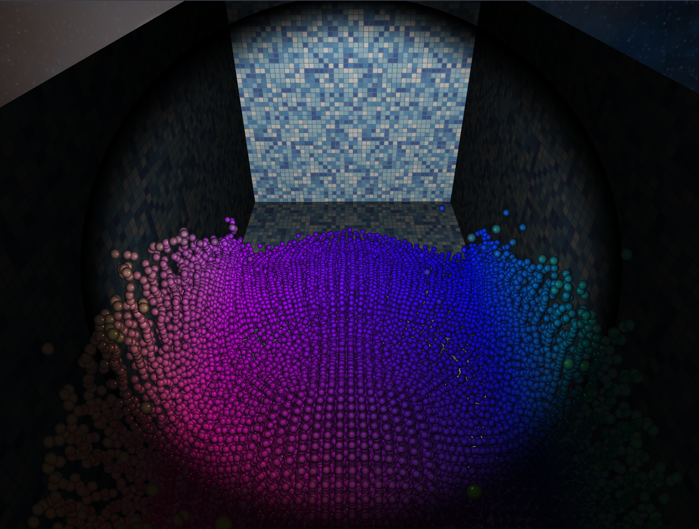

# Water Simulation

Combined SPH and OpenGL.

<video width="320" height="240" controls>
  <source src="https://github.com/Qervas/qervas.github.io/blob/master/assets/video/water_simulation.mp4?raw=true" type="video/mp4">
Your browser does not support the video tag.
</video>

## Todo

* [X] A free 3D camera
* [X] Water particles simulation
* [X] Basic visual effect: skybox, lighting, texture
* [ ] Connect particles into a surface

## Building Requirement

CUDA, gcc, glfw3, GLEW, CMake

## User Manual

| Key/Mouse Action | User Action                                         | Functionality                                             |
| ---------------- | --------------------------------------------------- | --------------------------------------------------------- |
| Left Mouse Click | Hold                                                | Focus on the camera and enable camera rotation            |
| Mouse Movement   | Move Up/Down/Left/Right (after focusing the camera) | Rotate the camera lens in the corresponding direction     |
| W                | Press/Hold                                          | Move the camera forward a certain distance/continuously   |
| S                | Press/Hold                                          | Move the camera backward a certain distance/continuously  |
| A                | Press/Hold                                          | Move the camera left a certain distance/continuously      |
| D                | Press/Hold                                          | Move the camera right a certain distance/continuously     |
| Space            | Press/Hold                                          | Move the camera up a certain distance/continuously        |
| Ctrl             | Press/Hold                                          | Move the camera down a certain distance/continuously      |
| Shift            | Hold                                                | Increase camera moving speed, release to return to normal |
| X                | Press                                               | Switch simulation status to running                       |
| P                | Press                                               | Toggle simulation status between pause and running        |
| R                | Press                                               | Initialize SPH particle data, and pause simulation        |
| ESC              | Press                                               | Close the program                                         |

## Acknowledgments

This project is based on the Smoothed Particle Hydrodynamics (SPH) simulation computational method from [CPP-Fluid-Particles](https://github.com/zhai-xiao/CPP-Fluid-Particles). I extend gratitude to [zhai-xiao](https://github.com/zhai-xiao) for their foundational work that enables our project to implement.
